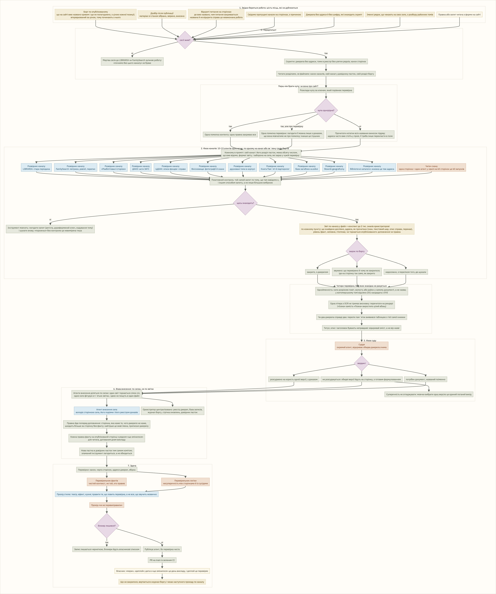

# Як «Місток» робить дозбір

Векторна версія: [dozbir.svg](dozbir.svg). Джерело схеми в Mermaid нижче.

Дозбір це друга половина роботи, про яку зазвичай не розповідають: що робити з тим, що вже опубліковано. Одиниця роботи тут не село, а канал джерел, борг або суперечка, і село зʼявляється лише наприкінці, на фазі внесення. Виміряно 2026-08-14: один агент по «Реабілітованих історією» дав приріст семи селам, один по Słownik geograficzny закрив девʼять, один по описах ЦДІАК сім. По селах ту саму роботу довелося б робити двадцять пʼять разів.

Головне правило дозбору: «порожньо» треба заслужити. Перш ніж записати, що джерело мовчить, доводиться довести, що інструмент узагалі здатен був щось знайти, тим самим запитом по чомусь, що там завідомо є, і іншим способом запиту, а не лише більшою вибіркою. Більшість наших «порожньо» була про наш інструмент, а не про джерело.

Кольори: блакитне це ролі на Claude Sonnet, теракотове на Claude Opus, сіро-зелене оркестратор і скрипти без моделі, жовте файли, які передаються далі, лілове ворота, через які робота не проходить, поки не чисто.

```mermaid
flowchart TB
  classDef s fill:#dcebf3,stroke:#7fa6bd,color:#1f4d66
  classDef o fill:#f0dfd0,stroke:#c99a7c,color:#7a3d1c
  classDef t fill:#e6e8dd,stroke:#9aa38b,color:#3f4a34
  classDef f fill:#f3ecd7,stroke:#c9b77a,color:#5f4a12,stroke-dasharray:5 3
  classDef g fill:#e8d9e6,stroke:#a98aa6,color:#5a2d55
  classDef h fill:#fbf7ea,stroke:#c9b77a,color:#3f3a2a

  subgraph B["1. Звідки береться робота: шість місць, які не дублюються"]
    direction TB
    B1["Борг по опублікованому<br/>що на сайті вже названо кривим і ще не полагоджено, з ціною кожної позиції;<br/>впорядкований за ціною, тому починають з нього"]:::f
    B2["Дозбір після публікації<br/>матеріал зі станом зібрано, звірено, внесено"]:::f
    B3["Відкриті питання на сторінках<br/>де вже названо, чим питання закривається:<br/>названа й не відкрита справа це невиконана робота"]:::f
    B4["Свідомо пропущені канали на сторінках, з причиною"]:::f
    B5["Джерела без адреси й без шифру, які знаходить скрипт"]:::f
    B6["Іменні рядки, що чекають на своє село, з розбору районних томів"]:::f
    B7["Правка або запит читача з форми на сайті"]:::h
  end

  subgraph P["0. Передпольот"]
    direction TB
    P1{"сесії живі?"}:::g
    P2["Мертва сесія до LIBRARIA чи FamilySearch зупиняє роботу:<br/>«почнемо без цього каналу» не буває"]:::t
    P3["Скрипти: джерела без адреси, томи в реєстрі без узятих рядків, канон сторінок"]:::t
    P4["Читати розділами, не файлами: канон каналів, свій канал у довіднику пасток, свій розділ боргу"]:::t
    P1 -- ні --> P2
    P1 -- так --> P3 --> P4
  end

  subgraph K["Перш ніж брати купу: чи вона про сайт?"]
    direction TB
    K1["Розклади купу за ключем, який порівнює перевірка"]:::t
    K2{"купа однорідна?"}:::g
    K3["Одна помилка контенту: одна правка закриває все"]:::t
    K4["Одна помилка перевірки: лагодити її можна лише з доказом,<br/>що вона мовчатиме не про помилку; інакше це глушник"]:::t
    K5["Прочитати нотатки всіх названих виносок підряд:<br/>адреса часто вже стоїть у прозі, її треба лише перекласти в поле"]:::t
    K1 --> K2
    K2 -- так --> K3
    K2 -- так, але про перевірку --> K4
    K2 -- ні --> K5
  end

  subgraph C["2. Фаза каналів: 10-15 агентів одночасно, по одному на канал або звʼязну групу боргів"]
    direction TB
    C1["Розвідник каналу<br/>LIBRARIA: стара періодика"]:::s
    C2["Розвідник каналу<br/>FamilySearch: метрики, ревізії, перепис"]:::s
    C3["Розвідник каналу<br/>«Реабілітовані історією»"]:::s
    C4["Розвідник каналу<br/>ДАКО: акти ЗАГС"]:::s
    C5["Розвідник каналу<br/>ЦДІАК: описи фондів і справи"]:::s
    C6["Розвідник каналу<br/>Вікісховище: фотографії й скани"]:::s
    C7["Розвідник каналу<br/>друковані томи в корпусі"]:::s
    C8["Розвідник каналу<br/>Книга Памʼяті й мартиролог"]:::s
    C9["Розвідник каналу<br/>бази загиблих на війні"]:::s
    C10["Розвідник каналу<br/>Słownik geograficzny"]:::s
    C11["Розвідник каналу<br/>бібліотечні каталоги: книжка це теж адреса"]:::s
    CS["Читач скану<br/>одна сторінка = один агент; у хвилі на 60 сторінок це 60 запусків"]:::o
    CR["Кожному в промпт: свій канал і його розділ пасток, межа обсягу числом,<br/>що вже відомо, формат звіту, і заборона на села, які зараз у чужій перевірці"]:::t
    CPn["Позитивний контроль: той самий запит по тому, що там завідомо є,<br/>і іншим способом запиту, а не лише більшою вибіркою"]:::t
    CP{"щось знаходить?"}:::g
    CP2["Інструмент мовчить: лагодити запит (регістр, дореформений ключ, кодування тому)<br/>і шукати знову; «порожньо» без контролю це невиміряна тиша"]:::t
    CF["Звіт по каналу у файл + конспект до 2 тис. знаків оркестраторові<br/>по кожному пункту: що знайдено дослівно, адреса, як прочитано (скан, текстовий шар, опис справи, переказ),<br/>рівень (факт, непевне, гіпотеза), чи торкається опублікованого: доповнення чи правка"]:::f
    CV{"вирок по боргу"}:::g
    CV1["закрито, з джерелом"]:::t
    CV2["звужено: що перевірено й чому не закрилося;<br/>іде на сторінку так само, як закрито"]:::t
    CV3["недосяжно, з переліком того, де шукали"]:::t
    CR --> C1 & C2 & C3 & C4 & C5 & C6 & C7 & C8 & C9 & C10 & C11
    C1 & C2 & C3 & C4 & C5 & C6 & C7 & C8 & C9 & C10 & C11 --> CPn
    CS --> CPn
    CPn --> CP
    CP -- ні --> CP2
    CP -- так --> CF --> CV
    CV --> CV1 & CV2 & CV3
  end

  subgraph F["4. Чотири перевірки, без яких знахідка не рахується"]
    direction TB
    F1["Однойменність: село розрізняє повіт, волость або район у самому документі, а не назва;<br/>у житомирському томі відсіяно 201 кандидата з 593"]:::t
    F2["Одна літера з OCR не тримає висновку: перечитати на рендері<br/>(«Іозка» замість «Лозка» виростило цілий абзац)"]:::t
    F3["Чи два джерела справді два: перелік памʼяток виявився таблицею з тієї самої книжки"]:::t
    F4["Титул, опис і заголовок бувають неправдиві: відкривай зміст, а не вір назві"]:::t
    F1 --> F2 --> F3 --> F4
  end

  subgraph J["5. Фаза суду"]
    direction TB
    J1["Суддя<br/>окремий агент, відкриває обидва джерела очима"]:::o
    J2{"вердикт"}:::g
    J3["розсуджено на користь однієї версії, з доказом"]:::t
    J4["не розсуджується: обидві версії йдуть на сторінку, з готовим формулюванням"]:::t
    J5["потрібен документ, названий поіменно"]:::t
    J6["Суперечність не згладжувати: мовчки вибрати одну версію це єдиний поганий вихід"]:::t
    J1 --> J2
    J2 --> J3 & J4 & J5
    J4 --> J6
  end

  subgraph V["6. Фаза внесення: по селах, не по звітах"]
    direction TB
    V0["Агенти внесення діляться по селах: один звіт торкається сімох сіл,<br/>одне село фігурує в пʼятьох звітах, і двоє не пишуть в один файл"]:::t
    V1["Агент внесення села<br/>володіє сторінкою села, його подіями і його реєстром доказів"]:::s
    V2["Оркестратор централізовано: реєстр джерел, база записів,<br/>журнал боргу, стрічка оновлень, довідник пасток"]:::t
    V3["Правка йде поперед доповнення: сторінка, яка каже те, чого джерело не каже,<br/>шкодить більше за сторінку без факту; найгірше це живі імена, приписані джерелу"]:::t
    V4["Кожна правка факту на опублікованій сторінці з рядком «що змінилося»<br/>для читача, датованим днем викладу"]:::t
    V5["Нова пастка в довідник пасток тим самим комітом;<br/>зламаний інструмент лагодиться, а не обходиться"]:::t
    V0 --> V1 --> V3 --> V4 --> V5
    V0 --> V2
  end

  subgraph H["7. Здача"]
    direction TB
    H1["Перевірки: канон, черга сторінок, адреси джерел, збірка"]:::t
    H2a["Перевіряльник фактів<br/>чистий контекст, не той, хто правив"]:::o
    H2b["Перевіряльник логіки<br/>несуперечність між сторінками й із сусідами"]:::o
    H3["Прохід стилю: театр, ефект, кухня; правити те, що ловить перевірка, а не все, що звучить незвично"]:::s
    H4["Прохід «чи не перевиправили»"]:::o
    H5{"блокер лишився?"}:::g
    H6["Запис лишається чернеткою, блокери йдуть власникові списком"]:::t
    H7["Публікує агент, бо перевірка чиста"]:::t
    H8["PR на main із зеленим CI"]:::t
    H9["Власник: «мерж», «деплой»; дата в «що змінилося» це день викладу, і деплой це перевіряє"]:::h
    H10["Що не закрилося, вертається в журнал боргу і чекає наступного проходу по каналу"]:::f
    H1 --> H2a & H2b --> H3 --> H4 --> H5
    H5 -- так --> H6
    H5 -- ні --> H7 --> H8 --> H9 --> H10
  end

  B1 & B2 & B3 & B4 & B5 & B6 & B7 --> P1
  P4 --> K1
  K3 & K4 & K5 --> CR
  CV1 & CV2 & CV3 --> F1
  F4 --> J1
  J3 & J4 & J5 --> V0
  V5 --> H1
```

## Чого дозбір не робить

- Не вигадує шифр, аркуш, адресу чи рік, навіть правдоподібний: вигадане посилання одного разу стояло на 45 опублікованих сторінках.
- Не переносить на сторінку нічого, чого немає в реєстрі доказів із джерелом.
- Не править файли села, яке саме зараз проходить перевірку в іншому PR.
- Не записує «порожньо» без позитивного контролю.
- Не робить сторінку сухішою: речення без посилання спершу звужується, дістає атрибуцію або картку джерела, і знімається лише доведено хибне.
- Не переписує старих рядків «що змінилося»: новий дописується поруч.
- Не публікує з блокером і не мержить сам: робота закінчується відкритим PR.

## Сторінка не стає сухішою

Правка поперед доповнення, але правка не означає викреслення. Речення без посилання спершу **звужується** до того, що джерело каже, або дістає **атрибуцію** («за спогадом N», «за переказом у книжці X»). Джерело існує, а картки в бібліографії немає - додається картка, а не знімається речення. Знімається лише доведено хибне або таке, для чого джерела немає ніде.

Жива деталь без доведеної хиби лишається: річка, прізвища на плиті, спогад, питання до мешканців. Правило зʼявилося після хвилі перевірки опублікованого, на якій чотири села втратили річку, сюжет про нагороджених жінок і абзац про одну людину там, де вистачало однієї картки.

## Рядок «що змінилося»

Кожна правка факту на опублікованій сторінці (число, дата, імʼя, висновок, зняте чи нове речення) дістає рядок для читача в тому самому коміті. Правила до нього виявилися важливішими, ніж здавалося:

- **для людини, що не знає проєкту**: що нового вона дізнається про село, одним реченням, орієнтир до 300 знаків. «У Макарові 1900 року було 569 дворів, а не 369.» Що саме змінилося в тексті, покаже різниця під рядком;
- **без внутрішніх слів**: ні «виноска», ні «атрибуція», ні «реєстр», ні «звірка», ні «та ще N дрібніших уточнень», і без однакового зачину на кожній сторінці;
- зняте твердження кажеться **разом із тим, що правда**;
- рядок порівнюється з редакцією, яку бачив читач, а не з проміжною, і його теж перевіряють проходи по дифу;
- **старі рядки незмінні**: новий дописується поруч, а перевірка падає на зниклому чи переписаному рядку. Хто читав сторінку раніше, має бачити, що саме тоді було не так.

Сам текст сторінки після правки себе не пояснює: ні «раніше тут стояло», ні «ми пропустили». Він читається так, ніби так було завжди; історія живе в рядку змін.

## Перевірка вже опублікованого: окремий режим

Крім каналів і суду, дозбір має третій режим: сторінки, які вийшли на сайт до того, як перевірка фактів проти джерел стала обовʼязковою. Одиниця роботи тут сторінка, і кожна йде тим самим повним порядком, що й нове село:

1. під наявні твердження добираються рядки реєстру доказів, без нових фактів;
2. два незалежні повні проходи перевірника фактів, кожен із чистим контекстом;
3. правки текстом таблиці рецензента, при двох варіантах вужчий;
4. кола по дифу, двома перевірниками й читачем, доки всі не чисті на теперішню редакцію;
5. рядок «що змінилося» там, де змінився факт.

Пілот на пʼяти сторінках сіл показав, навіщо це: від 12 до 32 різних помилок на сторінку, у середньому 22. Найчастіше це підсилення (сторінка каже більше за джерело) і посилання, що веде не туди; числа, дати й імена разом дають лише чверть. Серед них були й такі, що міняють факт для читача: 369 дворів замість 569 у Макарові, бо розпізнаний текст книжки хибний. Два рецензенти перетинаються мало: на чотирьох сторінках, де це порахували, дві третини різних помилок (67 зі 100) знайшов лише один. І правки самі вносять помилки: кожна сторінка після першого кола дала ще від 2 до 7 нових, тому кіл по дифу було від двох до шести.

Схема вище цього режиму ще не показує: вона намальована раніше і про канали.
