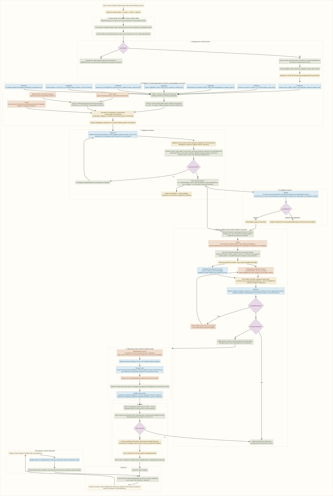

# Як «Місток» робить село

Векторна версія: [prohin-sela.svg](prohin-sela.svg). Джерело схеми в Mermaid нижче, його можна відкрити в будь-якому редакторі, що рендерить Mermaid.

Один прогін це одне село: від назви до відкритого PR, який читає власник. Роботу веде оркестратор, а кожен крок виконує окремий агент зі своєю роллю і своїм обмеженим входом: розвідник бачить лише свій канал джерел, автор лише зріз реєстру для своєї сторінки, перевіряльник фактів лише сторінку і джерела, і ніколи той, хто її писав. Жоден агент не підтверджує сам себе, і жоден не публікує: прогін закінчується відкритим PR.

Кольори: блакитне це ролі на Claude Sonnet, теракотове на Claude Opus, сіро-зелене оркестратор і скрипти без моделі, жовте файли, які передаються далі, лілове ворота, через які робота не проходить, поки не чисто. На одне село це 30-60 агентів, 1000-2000 запитів до моделі й 4-12 сторінок.

```mermaid
flowchart TB
  classDef s fill:#dcebf3,stroke:#7fa6bd,color:#1f4d66
  classDef o fill:#f0dfd0,stroke:#c99a7c,color:#7a3d1c
  classDef t fill:#e6e8dd,stroke:#9aa38b,color:#3f4a34
  classDef f fill:#f3ecd7,stroke:#c9b77a,color:#5f4a12,stroke-dasharray:5 3
  classDef g fill:#e8d9e6,stroke:#a98aa6,color:#5a2d55
  classDef h fill:#fbf7ea,stroke:#c9b77a,color:#3f3a2a

  IN["Запит читача з форми «Пропозиція» або власний вибір власника"]:::h
  Q["Черга сіл на сайті: запит → у черзі → готове → вийшло"]:::f
  IN --> Q --> S0a

  subgraph S0["0. Оркестратор читає рівно стільки, скільки треба"]
    direction TB
    S0a["Правила проєкту: як писати, як ставити виноски, чого не робити ніколи"]:::t
    S0b["Скіл прогону: порядок кроків, норми запусків, ціни й пастки, виміряні на попередніх селах"]:::t
    S0c["Сирих звітів агентів оркестратор не читає: лише конспект до 2 тис. знаків від кожного"]:::t
    S0a --> S0b --> S0c
  end

  subgraph S1["1. Передпольот, ще без агентів"]
    direction TB
    S1a{"сесії живі?"}:::g
    S1b["Без одного з двох каналів прогін не починається:<br/>LIBRARIA каже, чим село жило, FamilySearch дає аркуш з іменами"]:::t
    S1c["probe: що про село вже лежить на диску, які сусіди опубліковані,<br/>які записи з іменами вже є в базі"]:::t
    S1d["Газетир ЦДІАК: 4566 поселень із шифрами справ, один виклик"]:::t
    S1e["Бриф села, 15-25 КБ: іде кожному розвідникові як єдиний вхід"]:::f
    S1a -- ні --> S1b
    S1a -- так --> S1c --> S1d --> S1e
  end

  subgraph S2["2. Розвідка: 5-6 агентів одночасно, по агенту на зону джерел, не на тему"]
    direction TB
    R1["Розвідник<br/>архівні описи: ЦДІАК, ДАКО, описи фондів, справи за назвою села"]:::s
    R2["Розвідник<br/>омоніми й сучасне: скільки сіл із такою назвою, котре наше"]:::s
    R3["Розвідник<br/>краєзнавство: Похилевич 1864 і 1887, Słownik geograficzny, районні нариси"]:::s
    R4["Розвідник<br/>преса з LIBRARIA: газети 1900-1930-х, замітки з назвою села"]:::s
    R5["Розвідник<br/>документи з FamilySearch: метричні книги, ревізькі казки, перепис 1897"]:::s
    R6["Розвідник<br/>люди поіменно: книги памʼяті, «Реабілітовані історією», списки поселень"]:::s
    R7["Розвідник<br/>хто звідси вийшов: біографічні довідники, нагородні листи"]:::s
    RX["Пошук у корпусі з варіантами написань:<br/>Копіївка, Коптіївка, Коптевка, Kopciówka"]:::t
    RC["Цитату з тому в корпусі бере скрипт tsytata за локатором,<br/>а не памʼять моделі; обрив усередині речення заборонено"]:::t
    R8["Читач скану<br/>одна сторінка рукопису = один агент, ніколи цикл"]:::o
    R8b["Другий читач того самого аркуша<br/>наосліп, першого прочитання не бачить"]:::o
    R9["dvichi: зіставляє два читання клітинка в клітинку;<br/>розбіжність у числі або даті лишає рядок непевним"]:::t
    R10["Суддя<br/>одна означена суперечка між розвідниками або з брифом,<br/>вердикт з опорою на джерело"]:::o
    RF["Сирі звіти по напрямках<br/>+ іменні рядки в базі записів<br/>кожен факт: джерело, чи бачив сам, дослівна цитата з локатором"]:::f
    RP["Розділ «Перевірено, порожньо»: за якими словами шукали і не знайшли"]:::f
    R1 & R2 & R3 & R4 & R5 & R6 & R7 --> RX --> RC --> RF
    R8 --> R9
    R8b --> R9
    R9 --> RF
    R10 --> RF
    RF --> RP
  end

  subgraph S3["3. Зведення і рішення"]
    direction TB
    Z1["Зведення<br/>збирає звіти в реєстр доказів: id, теза, джерела, бачено, цитата, статус, ціль;<br/>суперечності не згладжує, факт без цитати стає «непевне»"]:::s
    Z2["Зведення села: паспорт, реєстр доказів, суперечності й ототожнення,<br/>перевірено порожньо, відкриті запити, сирі звіти"]:::f
    Z3a["research-check: кожен «факт» має цитату, кожна ціль веде на сторінку, id не повторюються<br/>tsytata perevirka: цитати проти корпусу, обриви й переказ замість дослівного<br/>research-check --syri: чи всі сирі звіти використано"]:::t
    Z3{"реєстр чистий?"}:::g
    Z4["Ні: зведення переробляється, автор зрізу не отримує"]:::t
    Z5["Оркестратор вирішує:<br/>які сторінки будуть (село, події, біографії), що піде лише рядком,<br/>чого не буде, і чи є в матеріалі сюжет для розбору"]:::t
    Z6["Сюжет для розбору → черга розборів,<br/>окремий скіл пише його зі звіреного матеріалу"]:::f
    Z1 --> Z2 --> Z3a --> Z3
    Z3 -- ні --> Z4 --> Z1
    Z3 -- так --> Z5 --> Z6
  end

  subgraph S35["3.5. Дозбір до письма"]
    direction TB
    D1["Дозбір<br/>по агенту на одну прогалину, яка блокує речення на запланованій сторінці:<br/>том без тексту, число лише з переказу, нерозсуджена суперечність, адресована й не відкрита справа"]:::s
    D2{"що вийшло?"}:::g
    D3["Новий рядок у реєстрі з цитатою"]:::f
    D4["Перелік незакритого: канальний дозбір закриє по багатьох селах одразу"]:::f
    D1 --> D2
    D2 -- закрито --> D3
    D2 -- звужено або недосяжно --> D4
  end

  subgraph S4["4. Письмо і звірка: цикл на одну сторінку, не на село"]
    direction TB
    W0["Зріз для сторінки: лише рядки реєстру з її ціллю,<br/>суперечності, що її стосуються, картки джерел;<br/>зведення цілком автор не бачить"]:::t
    W1["Автор<br/>пише сторінку зі зрізу, виноска при кожному твердженні;<br/>власної арифметики не веде, мовчання джерела без «перевірено, порожньо» не стверджує"]:::o
    W2["Автор сам проганяє машину в тому самому заході:<br/>partiia (числа проти партії), research-check --for (виноски поза зрізом),<br/>check-content --as-published (канон сторінки, кухня, виноски)"]:::t
    W3["Чернетка сторінки: село, подія, біографія або розбір"]:::f
    W4a["Перевіряльник фактів на Opus<br/>чистий контекст, не той, хто писав;<br/>кожне твердження проти джерела за методом Claimify"]:::o
    W4b["Перевіряльник фактів на Sonnet<br/>лише на сторінці села й біографіях:<br/>розбіжність двох моделей це головний сигнал"]:::s
    W5["Звіти звірки: блокери, «джерело каже інше»,<br/>«сказано менше, ніж дозволяє джерело», «не зміг перевірити»,<br/>і таблиця «Правки» наприкінці"]:::f
    W6["Правник<br/>виконує таблиці «Правки» механічно: зняти речення, замінити число, переклеїти виноску;<br/>зведення і джерел не відкриває; до 5 сторінок за запуск, стеля 25 викликів"]:::s
    W7{"«потрібен автор»?"}:::g
    W8["Автор повертається лише на ці рядки,<br/>з тим самим зрізом, без звітів звірки"]:::o
    W9{"блокер лишився?"}:::g
    W10["Сторінка лишається чернеткою,<br/>блокери йдуть власникові списком"]:::t
    W11["У фронтматер сторінки лягають шляхи всіх звітів звірки:<br/>без двох звітів на селі й біографії гейт не пропускає"]:::t
    W0 --> W1 --> W2 --> W3 --> W4a & W4b --> W5 --> W6 --> W7
    W7 -- так --> W8 --> W4a
    W7 -- ні --> W9
    W9 -- так --> W10
    W9 -- ні --> W11
  end

  subgraph S5["5. Один раз на село, коли всі сторінки готові"]
    direction TB
    L1["Перевіряльник логіки<br/>несуперечність між сторінками села і з сусідами:<br/>дати, числа, імена, звʼязки; бачить суперечність, якої ніхто не називав"]:::o
    L2["Правник виконує таблицю логіки; що потребує автора, повертає"]:::s
    L3["Прохід стилю<br/>мова після машинних перевірок: шаблонні звороти, театр, кухня проєкту,<br/>довгі речення й канцелярит за звітом rytm; фактів не чіпає"]:::s
    L3b["Прохід «чи не перевиправили»: факти на місці після стилю"]:::o
    L4["Скрипти: люди села з бази записів, кандидати в родини (не твердження), нотатки для читача"]:::t
    L5["Дозбір, друга хвиля<br/>що звірка не змогла перевірити, і кожне «відкрите питання» сторінки:<br/>названа й не відкрита справа це невиконана робота, прогін не здається"]:::s
    L1 --> L2 --> L3 --> L3b --> L4 --> L5
  end

  subgraph S6["6. Здача"]
    direction TB
    H1["verify: усі перевірки разом; check-content --queue;<br/>dzherela-check: чи існують URL, на які послалися"]:::t
    H2["Облік прогону: розклад агентів з транскриптів, читання кешу й вивід за сесією;<br/>блокери рахуються зі звітів, не по памʼяті"]:::t
    H3{"гейт чистий?"}:::g
    H4["Сторінки published; або draft з датою релізу в буденний день,<br/>гейт прогнано наперед, у день релізу лишається сама заміна рядка"]:::f
    H5["Село в черзі стає «готове» з датою; календар релізів"]:::f
    H6["PR на main із зеленим CI: збірка сайту, перевірка змін, перевірка дати викладу"]:::t
    H1 --> H2 --> H3
    H3 -- так --> H4 --> H5 --> H6
    H3 -- ні --> W10
  end

  subgraph S7["7. Власник"]
    direction TB
    O1["Читає PR і каже «мерж»"]:::t
    O2["У день релізу: сторінки відкриваються, запис у стрічку оновлень,<br/>село в черзі стає «вийшло», «деплой»"]:::t
    O3["Сторінка на сайті: кожне твердження з виноскою, розділи «Чого ми ще не знаємо»,<br/>«Як ми це шукали», «Як посилатися»"]:::h
    O1 --> O2 --> O3
  end

  subgraph S8["Після релізу: сторінка живе далі"]
    direction TB
    P1["Правка читача з форми «Правка» або нове джерело"]:::h
    P2["Дозбір: борги по опублікованих сторінках, канальний прохід по багатьох селах"]:::s
    P3["Кожна правка факту з рядком «що змінилося» для читача, датованим днем викладу"]:::t
    P1 --> P2 --> P3 --> O2
  end

  S0c --> S1a
  S1e --> S2
  RP --> Z1
  Z5 --> D1
  D3 --> W0
  Z5 --> W0
  W11 --> S5
  L5 --> H1
  H6 --> O1
  O3 --> P1
```

## Чого не робить жоден агент

- Не вигадує шифр, аркуш, адресу, рік, навіть правдоподібні.
- Не переносить на сторінку нічого, чого немає в реєстрі з джерелом і дослівною цитатою.
- Не перевіряє сам себе: автор і перевіряльник це різні агенти з різним входом.
- Не публікує сторінку з блокером: вона лишається чернеткою, а блокери йдуть власникові.
- Не мержить і не деплоїть: прогін закінчується відкритим PR, далі вирішує людина.
